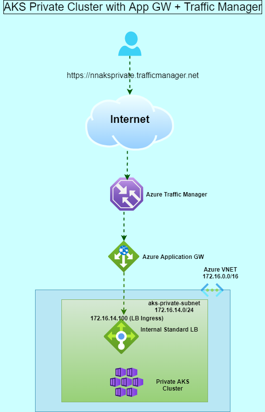
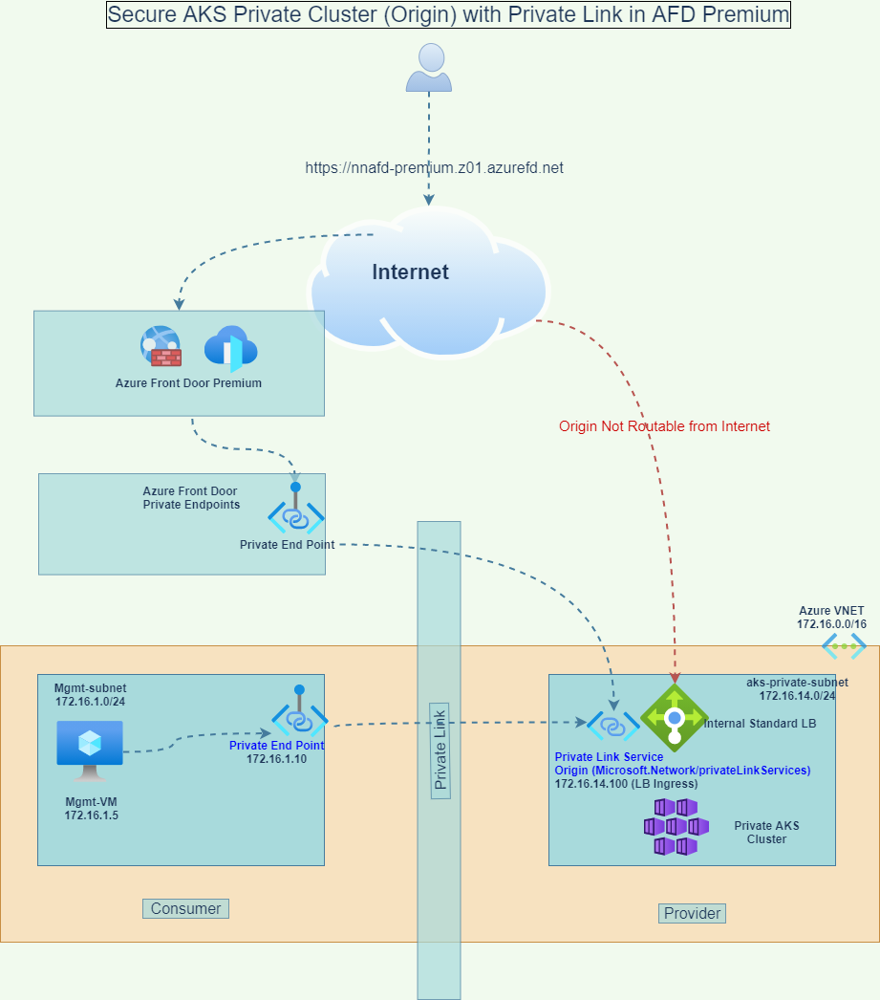

# Purpose

Expose Private Cluster ILB endpoint using global load balancer.

## Azure Documentation

https://docs.microsoft.com/en-us/azure/frontdoor/standard-premium/concept-private-link

# Architecture diagram

## Using Application Gateway and Traffic Manager

## Using Azure Front Door Premium and Private Endpoints

## Use case and Design Requirements

A private AKS cluster with global load balancing requirements

## Prerequisites

1. Kubernetes Private Cluster with ILB
2. AFD Premium
3. AKS Private Cluster in Azure

## Project tasks breakdown

1. [Create Private Link Service](private-link-service/README.md)
2. [Create Private Endpoint in Management Network](private-end-point/setup.md)
3. [Private Endpoint with Azure Front Door (AFD) Premium](with-AFD-premium/README.md)
4. [Azure Application Gateway and Traffic Manager](with-TM-and-app-gw/README.md)

## Contributors

## Acknowledgments
